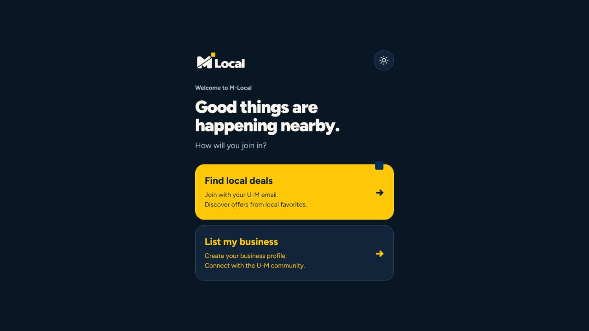
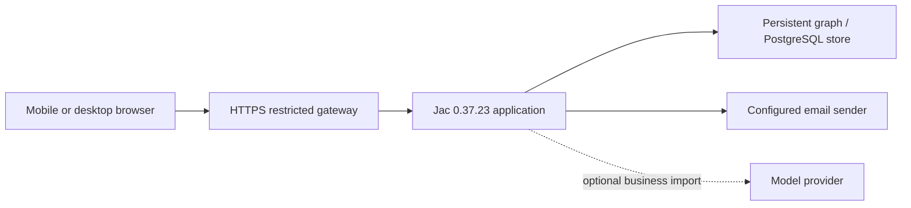

# M-Local: connected restaurant offers

M-Local is a team-built JacHacks prototype connecting Ann Arbor students with
time-limited local restaurant offers. Its strongest demonstration is the complete
transaction: discovery, a claim with saved terms, merchant QR verification,
one-time redemption and business reporting.

## Team and attribution

Git history records contributions from Travis Jones, Rohan Maxa, Manthan Patil,
and Adam Jiang (also `adamjiang06`), plus the `stonedegree` contributor identity.
This is a collaborative project. The original four-owner contract separates
runtime/integration, backend transactions, local context/data, and frontend/mobile
work. See [the team contract](TEAM-CONTRACT.md) and the repository commit history
for ownership and individual changes. Do not present the entire app as one
person's work or infer a person's ownership from commit counts.

## A useful three-minute walkthrough

1. Open the welcome screen and browse the student offers. Explain that displayed
   sample offers are fictional and cannot be redeemed at real restaurants.
2. Show filtering and an offer's price, validity window, eligibility and terms.
3. In prepared, separate student and merchant sessions, claim an offer and show
   its QR pass. Explain that the hold reserves inventory for up to 20 minutes.
4. Preview the QR in the merchant session, confirm redemption, then show that a
   second redemption is rejected. Saved claim terms remain authoritative.
5. Open Insights and explain the difference between recorded activity and
   demonstrated business impact. Simulated activity does not establish sales.

For an asynchronous reviewer without an account, the [README screenshots](../README.md#screenshots)
show the student and business paths. Those images are dated, use fictional test
data, and are not evidence of physical phone or camera testing.

The public welcome screen below was captured from the restored HTTPS app on
2026-09-29. The student signup path also rendered in the browser; no email was
sent during that check.

## Architecture and engineering decisions

The deployed laptop path uses Tailscale Funnel, a restricted Node gateway and a
loopback Jac server. The server owns authorization, quantity, expiry and QR
redemption. The QR identifies a claim; it does not carry authoritative prices or
personal information. Matching works without a model call. Public admin, schema
and unapproved function routes are blocked by the gateway.

The runtime pin, isolated test stores, deployment preflight and rollback helpers
make the project reproducible without resetting the shared demonstration data.
Pull requests and main pushes run the same checks workflow. CI evidence must
match the exact commit being presented.

## Release checkpoint

Checked 2026-09-29:

- GitHub main was `772b9d3ee180b08464d6988e8827d303c6302e67` with a
  [passing checks run](https://github.com/CosmonautJones/m-local/actions/runs/36337499196).
- No open pull requests were present at inspection. Four remote branches were
  not ancestors of main: `default_auth`, `feat/02-offer-trust`,
  `feat/03-local-context`, and `feature/admin-approval-new`. They were preserved,
  not automatically integrated. An old approval branch does not override the
  current self-service business flow.
- The laptop service was offline and was restarted from its existing clean
  phone-link checkout and persistent store. The original working checkout and
  its uncommitted team work were left untouched.
- SHA-256 comparison of all 97 application/configuration/resource files in the
  live runtime against the clean deployment checkout found no mismatches or
  extra source files. The runtime revision marker also matched `772b9d3`.
- [Public health](https://mlocal.tail0d5ef8.ts.net/healthz) returned
  `{"ready":true}` after restart; anonymous feed returned four existing offers.
- This recovery uses `-NoAutoUpdate`. The app stays on the verified revision
  until a deliberate deployment; this differs from the normal auto-update mode
  described in [HOSTING.md](HOSTING.md).

## JacHammer hosting checkpoint

**Update, September 29 at 21:33 Eastern:** the public production URL is
[m-local-main-prjc0b.jachammer.app](https://m-local-main-prjc0b.jachammer.app/).
The application, gateway and PostgreSQL are healthy (3/3 pods, zero restarts).
HTTPS welcome, student onboarding, guest session and catalog responses work.
Anonymous claim and merchant endpoints return 401; guest offers contain no QR
credentials. All 397 returned offers are marked as demo data.

This is a working production boot, not completed release acceptance. Onboarding
still stores its SQLite database and signing key under the application's
ephemeral directory. A dedicated persistent disk with one app replica and a
non-overlapping rollout was validated with the pinned compiler's manifest
generator, but has not been deployed or restart-tested. Preserve existing
onboarding data before any migration. Raw runtime registration/login handlers
also remain reachable; the laptop gateway's restrictions do not apply here.
Real email, student/merchant flows, backups, source parity and custom-domain
acceptance remain open. Do not encourage real account creation yet.

The provider dashboard reports production live, while its deployment-history
record still says `in_flight`. Do not submit a duplicate deployment merely to
clear that stale indicator. The previously attempted `m-local.jachammer.app`
address below is historical and is not this deployment's public URL.

### Earlier preparation evidence

Checked September 29, 2026, at 12:28 Eastern. The signed-in account has an
existing Pro entitlement. No purchase or upgrade was made.

The existing M-Local-Main project is
`prj_c0b45632e1d64a60bb45efbe7397a42d`. The old main binding referred to a
separate M-Local project, and JacHammer explicitly rejected that source refresh.
The release branch corrects the `[jachammer]` project ID. Before source refresh,
the divergent hosted commit `5ae317a0847cceb94936386849a3d0b745ea5af5` was saved
as a JacHammer checkpoint and pushed to `codex/jachammer-preserved-2026-09-29`.
Its unmerged catalog/archive changes remain available for review.

The refreshed GitHub source ran successfully in the authenticated project
preview: Jac 0.37.23 compiled the app, initialized embedded PostgreSQL 18.6,
started its API and frontend, returned HTTP 200 for `current_session`, and rendered
the welcome screen. This is evidence that GitHub-imported source can run the
backend and database. Building the code inside JacHammer is not a requirement.
The preview requires provider authentication and is not a public app link.

GitHub imports transfer source, not existing local or sandbox database contents.
Secrets also require explicit environment configuration; they do not come from
Git history. The eight existing project environment keys remained present during
this refresh. Their values were not changed. Accounts and activity were not
reset, and migration of old data into a new production database is not proven.

A permanent deployment was submitted from `codex/portfolio-release-checkpoint`
after full CI passed at `ab5ac57248df9d8ae1b218a062327ba8f020acfd`
([checks](https://github.com/CosmonautJones/m-local/actions/runs/36595876928)).
Automatic deployment is disabled. The requested address is `m-local.jachammer.app`,
but it is **not yet verified live**. The provider remained in Prepare after
creating and attaching a persistent PostgreSQL volume and starting its PostgreSQL
18 container at 12:18:16 Eastern. No subsequent app rollout or explicit failure
was visible by 12:28; the requested address returned HTTP 404. The deployment was
left running, with no destructive retry or database removal.

The laptop link remains the verified public demonstration and still depends on
the laptop staying online. Permanent release acceptance needs a ready application,
authenticated student/merchant flows, email delivery, repeated-redemption
rejection, persistence across restart, backup/restore proof, and real phone/camera
verification. A provisioned volume, successful homepage, or CI run alone does not
satisfy these checks. Production route restrictions must also be checked directly;
the laptop gateway results cannot establish the hosted ingress behavior.
