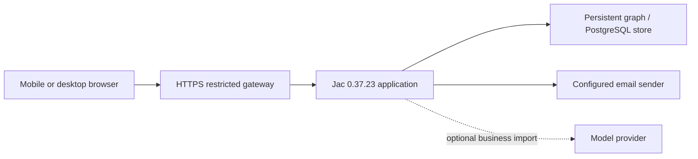

# M-Local: connected restaurant offers

M-Local is a team-built JacHacks prototype connecting Ann Arbor students with
time-limited local restaurant offers. Its strongest demonstration is the complete
transaction: discovery, a claim with saved terms, merchant QR verification,
one-time redemption and business reporting.

## Team and attribution

Git history records contributions from Travis Jones, Rohan Maxa, Manthan Patil,
and Adam Jiang (also `adamjiang06`), plus the `stonedegree` contributor identity.
This is a collaborative project. The original four-owner contract separates
runtime/integration, backend transactions, local context/data, and frontend/mobile
work. See [the team contract](TEAM-CONTRACT.md) and the repository commit history
for ownership and individual changes. Do not present the entire app as one
person's work or infer a person's ownership from commit counts.

## A useful three-minute walkthrough

1. Open the welcome screen and browse the student offers. Explain that displayed
   sample offers are fictional and cannot be redeemed at real restaurants.
2. Show filtering and an offer's price, validity window, eligibility and terms.
3. In prepared, separate student and merchant sessions, claim an offer and show
   its QR pass. Explain that the hold reserves inventory for up to 20 minutes.
4. Preview the QR in the merchant session, confirm redemption, then show that a
   second redemption is rejected. Saved claim terms remain authoritative.
5. Open Insights and explain the difference between recorded activity and
   demonstrated business impact. Simulated activity does not establish sales.

For an asynchronous reviewer without an account, the [README screenshots](../README.md#screenshots)
show the student and business paths. Those images are dated, use fictional test
data, and are not evidence of physical phone or camera testing.

The public welcome screen below was captured from the restored HTTPS app on
2026-09-29. The student signup path also rendered in the browser; no email was
sent during that check.

## Architecture and engineering decisions

The deployed laptop path uses Tailscale Funnel, a restricted Node gateway and a
loopback Jac server. The server owns authorization, quantity, expiry and QR
redemption. The QR identifies a claim; it does not carry authoritative prices or
personal information. Matching works without a model call. Public admin, schema
and unapproved function routes are blocked by the gateway.

The runtime pin, isolated test stores, deployment preflight and rollback helpers
make the project reproducible without resetting the shared demonstration data.
Pull requests and main pushes run the same checks workflow. CI evidence must
match the exact commit being presented.

## Release checkpoint

Checked 2026-09-29:

- GitHub main was `772b9d3ee180b08464d6988e8827d303c6302e67` with a
  [passing checks run](https://github.com/CosmonautJones/m-local/actions/runs/36337499196).
- No open pull requests were present at inspection. Four remote branches were
  not ancestors of main: `default_auth`, `feat/02-offer-trust`,
  `feat/03-local-context`, and `feature/admin-approval-new`. They were preserved,
  not automatically integrated. An old approval branch does not override the
  current self-service business flow.
- The laptop service was offline and was restarted from its existing clean
  phone-link checkout and persistent store. The original working checkout and
  its uncommitted team work were left untouched.
- SHA-256 comparison of all 97 application/configuration/resource files in the
  live runtime against the clean deployment checkout found no mismatches or
  extra source files. The runtime revision marker also matched `772b9d3`.
- [Public health](https://mlocal.tail0d5ef8.ts.net/healthz) returned
  `{"ready":true}` after restart; anonymous feed returned four existing offers.
- This recovery uses `-NoAutoUpdate`. The app stays on the verified revision
  until a deliberate deployment; this differs from the normal auto-update mode
  described in [HOSTING.md](HOSTING.md).
- The previously recorded JacHammer sandbox returned HTTP 404. The available
  browser session was signed out, so its project state could not be inspected
  or redeployed. Source imports do not transfer accounts or databases.

## What remains before permanent production hosting

The existing JacHammer **M-Local-Main** project is the first target to inspect
after account sign-in. Its recorded project ID is
`prj_c0b45632e1d64a60bb45efbe7397a42d`; the repository's `[jachammer]` ID refers to
this project on the release branch. The old main binding referred to another
project and JacHammer rejected importing it into M-Local-Main. This was verified
in the signed-in source review on September 29 and corrected in `jac.toml`.
Preserve the
existing hosted settings and data, compare the current source revision, and use
the existing project's deployment controls.

The signed-in account is Pro. Before refreshing source, the hosted commit
`5ae317a0847cceb94936386849a3d0b745ea5af5` was saved as a JacHammer checkpoint
and pushed to `codex/jachammer-preserved-2026-09-29`. It contains unmerged
catalog/archive changes and remains available for review. No hosted source
changes were pushed over GitHub main.

The [JacHammer pricing page](https://jachammer.ai/#pricing), checked 2026-09-29,
lists 30-minute previews on Free and one permanent deployment on Builder at
$15/month. Account entitlement and payment approval were not established. No
subscription was purchased. Confirm current pricing in the signed-in account.

Permanent release acceptance still needs authenticated hosted student/merchant
flows, email delivery, repeated-redemption rejection, persistence across restart,
backup/restore proof, and real phone/camera verification. A successful homepage
or CI run alone does not satisfy those checks. Keep the laptop URL labeled as a
host-dependent demonstration until a permanent host passes these checks.
