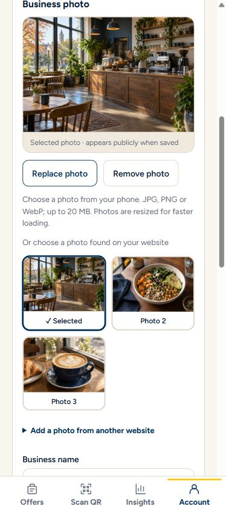

# Connected photo and UI review

This branch brings the verified local photo proposal into the application.
Keep Michigan navy/maize/Figtree, the single appearance control, Offers-first
business navigation and direct Scan QR access. Give business identity and each
offer their own photo rather than repeating one business image everywhere.

Business setup/edit and offer editing now support phone upload, visible website
thumbnail choices, a large selected preview, replacement and removal. Saving a
website photo imports a normalized owned JPEG; public filenames are random and
ownership stays in a private registry. The public business page, offer detail
and student feed display the appropriate photos, with image failure states.
Past offers are collapsed, and an expired paused offer cannot show Resume.
Business approval and review of name/address changes remain in place.

## Visual review

All screenshots use fictional businesses and illustrative sample imagery.
They contain no private QR credentials or real merchant product claims.

| View | Screenshot |
|---|---|
| Business setup/edit: preview and image choices | [390px light](review/photo-ux-v17/390-light-business-photo-picker.png), [320px dark](review/photo-ux-v17/320-dark-business-photo-picker.png) |
| Offer editing | [390px light](review/photo-ux-v17/390-light-offer-editor.png) |
| Public business page | [390px light](review/photo-ux-v17/390-light-business-page.png) |
| Student discovery | [390px light](review/photo-ux-v17/390-light-student-feed.png), [320px dark](review/photo-ux-v17/320-dark-student-feed.png) |
| Offer detail | [390px light](review/photo-ux-v17/390-light-offer-detail.png), [320px dark](review/photo-ux-v17/320-dark-offer-detail.png) |
| Former feed with matching fictional content | [390px light](review/photo-ux-v17/390-light-former-student-feed.png) |

The [council report](review/photo-ux-v17/council-review.md) records four
independent simulated reviewer lenses and the advisor's chair synthesis.
Earlier grades describe the states reviewed then, not this final revision or
production readiness. The simpler navigation was retained; criticism of weak
imagery and media trust was accepted. This is design review, not customer research.

The [accepted 50-second demo](demo/README.md) explains the student/business
journey. It predates this photo revision and remains separate from its screenshots.

## Verification and scope

The application source digest matches the isolated verified proposal:
`54c0f42cfa62a0eb06d9d4198543782cc85079925e64234e8a00cc37bc8b5826`.
The protected gateway source was verified separately. Retained evidence reports:

- Official Jac 0.37.23 check and sealed build passed.
- Seven media tests and seven ingress tests passed.
- 41 core tests passed; six were skipped.
- 130 compiled UI scenarios passed.
- 25 native HTTP/restart checks and three actual external image-import checks passed.
- Browser uploads, save/reopen, independent business/offer display, thumbnail
  selection, keyboard/pointer access and measured 320/390px views were checked.

The [compact receipt](review/photo-ux-v17/verification.json) records scope and
limits. This is previously executed evidence for the identical application
source, not a claim that fresh GitHub CI has passed. The media suite is included
in the branch's CI workflow.

## Release gates still open

This is a review branch, not a public deployment or production release.
Protect uploaded photos from source replacement, persist them with their private
ownership registry, and prove coordinated backup/restore. Define conservative
orphan cleanup before deleting unreferenced uploads. Physical iPhone/Safari/HEIC
and large-camera-photo decoding remain unverified. Representative merchant
website extraction remains a pilot check; the external import proof used a W3C
PNG, and the visible website-choice fixture used fictional samples.

Remote image retrieval currently holds the shared mutation lock. Measure its
effect on claims/redemption before scaling. The separate derivative-runtime
sealing blocker remains open; the application still uses official Jac 0.37.23.
Real U-M email signup testing belongs to the team. See
[release acceptance](RELEASE-ACCEPTANCE.md), [backup/recovery](BACKUP-RECOVERY.md)
and [runtime risk](RUNTIME-TRANSACTION-RISK.md).
